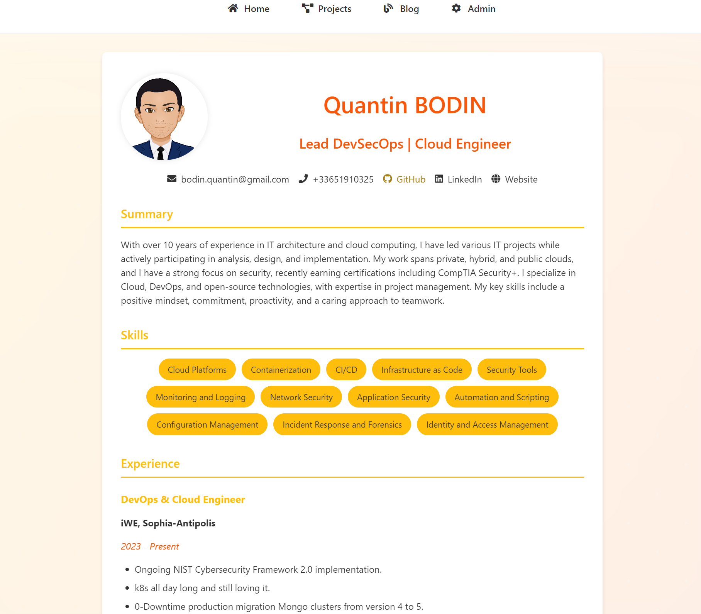

# Portfolio Website

A modern, responsive portfolio website built with Flask, featuring a blog, project showcase, and an admin panel for easy content management.



## Table of Contents

1. [Features](#features)
2. [Prerequisites](#prerequisites)
3. [Installation](#installation)
4. [Configuration](#configuration)
5. [Usage](#usage)
6. [Customization](#customization)
7. [Deployment](#deployment)
8. [Contributing](#contributing)
9. [License](#license)

## Features


- Display projects and blog posts
- Responsive design for various screen sizes
- SEO-friendly structure
- Dark mode support
- Admin interface for adding, editing, and deleting content
- Markdown support for content
- Basic authentication for admin access
- HTTPS enforcement

## Prerequisites

- Python 3.7+
- pip (Python package manager)
- Git (optional, for cloning the repository)

## Installation

1. Clone the repository:
   ```
   git clone https://github.com/NSR2X/portfolio.git
   cd portfolio
   ```

2. Create a virtual environment and activate it:
   ```
   python -m venv venv
   source venv/bin/activate  # On Windows, use `venv\Scripts\activate`
   ```

3. Install the required packages:
   ```
   pip install -r requirements.txt
   ```

4. Set up the configuration:
   - Rename `config.py.example` to `config.py`
   - Update the `ADMIN_USERNAME` and `ADMIN_PASSWORD` in `config.py`

5. Run the application:
   ```
   python app.py
   ```

## Usage

- Access the main website at `http://localhost:5001`
- Access the admin interface at `http://localhost:5001/admin`
  (You'll be prompted for the username and password set in `config.py`)

## Security

- HTTPS is enforced using Flask-Talisman
- Admin routes are protected with HTTP Basic Authentication
- Make sure to keep your `config.py` file secure and never commit it to version control

## Contributing

Pull requests are welcome. For major changes, please open an issue first to discuss what you would like to change.

## License

This project is open source and available under the [Creative Commons Zero v1.0 Universal (CC0) License](LICENSE).